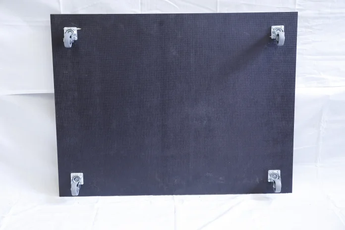

> # Rauchreinigungsanlage für Lasercutter
> **Hintergrund** 17.08.2018 13:29 Uhr Heinz Behling
> 
> 
> Das Innenleben des Make-Rauchgasfilters
> 
> Lasercutter qualmen und stinken. Mit dem Make-Rauchreiniger wird das anders: Für wenig Geld bauen Sie einen Abgasfilter, der Ihnen und Ihren Nachbarn jede Abgas-Belästigung erspart. Und das zu einem Bruchteil des Preises kommerzieller Geräte, die gerne einmal mehrere Tausend Euros fordern. Insgesamt kommt die Anlage nämlich mit rund 400 Euro aus.
> 
> ## Der Bau des Luftfilters
> 
> ### Leisten montieren
> 
> Zunächst müssen Sie alle Gehäuseplatten vorbereiten. Auf den [downloadbaren Zeichnungen](ftp://ftp.heise.de/pub/hacks/listings/1804-140.zip) der einzelnen Siebdruckplatten sind die Maße und Positionen der Rahmenleisten genau angegeben.
> 
> 
> 
> Beginnen Sie mit der Bodenplatte. Schneiden Sie die Leisten zu und schrauben Sie sie mit Universalschrauben an die Platten. Die glatten Seiten der Platten bilden die Gehäuse-Außenseiten. Achten Sie beim Zuschneiden der Leisten genau auf die jeweilige Länge, denn davon hängt die spätere Dichtheit des Filters wesentlich ab. Keinesfalls darf eine Leiste zu lang sein und irgendwo überstehen, denn dort könnte sich die benachbarte Gehäuseplatte niemals luftdicht anlegen. Ist hingegen eine Leiste einmal ein wenig zu kurz geraten, kann dies notfalls durch Dichtmittel ausgeglichen werden. Die Leisten werden mit Universalschrauben (siehe Materialliste) befestigt.
> 
> ### Löcher sägen
> 
> 
> 
> In einige Platten müssen Löcher gesägt werden: In den Deckel kommt die Ansaugöffnung. Dort wird ein Schlauchanschlussstutzen der Nennweite 100 mm aufgeschraubt. Den erhalten Sie im Baumarkt beim Zubehör für Dunstabzugshauben. Das Bild zeigt die Deckelplatte von oben. Die Leisten befinden sich unter der Platte!
> 
> 
> 
> Der Zwischenboden über dem Aktivkohlefilter erhält eine Öffnung entsprechend dem Durchmesser des Filterauslasses (125 mm). Die glatte Seite dieses Bodens weist vom Filter weg nach oben, denn sie wird als Dichtfläche für den Hepafilter benötigt.
> 
> 
> 
> Auch die Platte über dem Hepafilter erhält ein Loch für das Gebläse. Hier muss jedoch die glatte Seite nach unten zum Filter zeigen, denn auch sie dient als Dichtfläche.
> 
> 
> 
> Schließlich ist noch die Auslassöffnung an der Rückseite des Filters zu sägen. Davor können Sie ein selbstgelasertes Auslassgitter schrauben, damit es auch schön aussieht.
> 
> 
> 
> An der Unterkante der Zwischenwand muss ein Teil als Überströmöffnung herausgesägt werden. Auch diese Maße sehen Sie in den Kontsruktionszeichnungen.
> 
> ## Die Bodenplatte
> 
> 
> 
> An die schmalen Seiten des Bodens werden im Abstand von 15 mm zum Rand 27 mm-Leisten mit Universalschrauben geschraubt. Die Löcher in den Leisten müssen mit einem 3 mm Bohrer vorgebohrt werden, sonst brechen die Leisten beim Schraubenanziehen. Diese Leisten halten später die Wände. Auch die Enden der Leisten müssen jeweils 15 mm vor der Kante der Bodenplatte enden. Achtung: Diese Abstände sind für die Dichtheit des Filters sehr wichtig. Kontrollieren Sie sie besser einmal zu viel und befestigen Sie die Leisten mit Schraubzwingen, bevor Sie sie anschrauben. Als Abstandslehre für die 15 mm Kantenabstand können Sie die kleinste der Siebdruckplatten verwenden, die ja ebenfalls 15 mm dick ist! Als nächstes bauen Sie an den Längsseiten der Bodenplatte Leisten mit ebenfalls 15 mm Abstand zur Kante ein. Das ergibt schließlich einen kompletten Leistenrahmen.
> 
> Schließlich folgen noch die beiden kleinen Leisten zur Befestigung der Zwischenwand. Übrigens: Fichtenleisten neigen dazu, krumm zu sein. Das ist nicht weiter tragisch, muss aber an besonders krummen Stellen gegebenenfalls durch zusätzliche Schrauben korrigiert werden. Es darf nach dem Festschrauben kein Spalt zwischen Leiste und Bodenplatte auftreten.
> 
> 
> 
> Damit der Schrank später einfach zu bewegen ist, bekommt er Rollen. Legen Sie eine Rolle mit der Befestigungsplatte auf die Bodenplatte in den Winkel des Leistenrahmens. Markieren Sie die Befestigungslöcher und bohren Sie dann Löcher mit 6~~ mm Durchmesser. Danach schrauben Sie die Rollen von unten an die Platte (5~~mm Schrauben mit Muttern). Sie dürfen auch ruhig kürzere als ich verwenden!
> 
> ## Zwischen- und Seitenwände
> 
> ### Die Seitenwände
> 
> 
> 
> Jetzt braucht man die Hilfe einer zweiten Person. Die muss die linke Seitenwand an die entsprechende Leiste der Bodenplatte halten, während Sie in die Platte von außen mit einem 7 mm Bohrer 3 Löcher im Abstand von 15 mm von der Unterkante der Seitenwand bis in die Leiste hinein bohren. In diese Löcher kommt jeweils von außen eine Schraube (M5 x 60) mit Unterlegscheibe und von innen eine Einschlagmutter M5. Ziehen Sie die Schrauben so fest , dass sich die Zacken der Mutter ins Holz der Leiste pressen. Falls die Schraube zu kurz ist, schrauben Sie sie zunächst ohne die Seitenplatte ein.
> 
> 
> 
> Wiederholen Sie das mit der rechten Seitenwand.
> 
> ### Die Zwischenwand
> 
> 
> 
> Beim Einbau der Zwischenwand muss der Überstromausschnitt unten liegen. Das Bild oben zeigt die linke Seite der Zwischenwand. Sie muss zur linken Seitenwand zeigen.
> 
> 
> 
> Entsprechend zeigt diese der Zwischenwand zur rechten Seite. Die beiden kleinen Befestigungsleisten auf der Bodenplatte müssen an der rechten Seite der Zwischenwand anliegen. Bohren Sie dort ebenfalls Löcher und schrauben Sie die Seitenwand mit Gewindeschrauben M5 x 60 und Muttern an.
> 
> ## Die Rückwand
> 
> 
> 
> Die Rückwand muss so an die hintere Leiste der Bodenplatte geschraubt werden, dass die Auslassöffnung rechts oben liegt. Dabei müssen Sie alles so ausrichten, dass die Kanten der Seiten- und Rückwand bündig anliegen (Schraubzwingen!). Die Rückwand wird wiederum mit M5 x 60 Gewindeschrauben und Einschlagmuttern wie zuvor beschrieben montiert. Auf die Leisten kleben Sie zuvor jedoch Schaumstoff-Dichtstreifen.
> 
> 
> 
> Auch auf die vorderen Kanten kommen Dichtungen. Kontrollieren Sie, ob die Oberkanten der drei Wände auch wirklich auf einer Höhe mit der Rückwandkante sind. Falls nicht, haben Sie irgendwo etwas ungenau zusammengeschraubt. Suchen Sie dann die Ursache und beheben Sie sie. Andernfalls wird der Filter Probleme mit der Dichtheit bekommen.
> 
> ## Einbau der Filter
> 
> ### Die Vorfilter
> 
> 
> 
> Setzen Sie nun die beiden Vorfilter in die linke Kammer des Filtergehäuses ein. Da der Grobfilter kürzer ist als das Gehäuse schrauben Sie noch die kleine Siebdruckplatte hinter ihm auf die Rahmenleisten. Auch auf die vorderen Kanten der Filterrahmen kleben Sie Dichtstreifen.
> 
> ### Der Aktivkohlefilter
> 
> 
> 
> Stellen Sie den Kohlefilter in die rechte Filterkammer und legen Sie den Zwischenboden mit der glatten Seite nach oben ein. Die Auslassöffnung des Filters muss mittig im Loch des Zwischenbodens sitzen. Legen Sie dann einen der Plexiglasringe, dann den Schaumstoffring und den zweiten Plexiglasring auf den Filterauslass. Achten Sie darauf, dass die Schraublöcher der drei Ringe übereinander liegen. Mit acht kurzen Universalschrauben befestigen Sie den Ringstapel vorsichtig. Nicht zu fest anziehen, damit das Plexiglas nicht bricht. Nehmen sie den Zwischenboden wieder heraus.
> 
> Der Zwischenboden hat an den Kanten zwei Löcher. Bohren Sie in die Leisten entsprechend ebenfalls Löcher (7 mm). Stecken Sie dort von unten je eine M5 x 60 Gewindeschraube mit Unterlegscheibe durch. Obendrauf kommt eine Einschlagmutter direkt auf die Leiste. Schrauben Sie das so fest, dass die Mutter sich in die Leiste presst. Nun legen Sie den Zwischenboden wieder ein. Die beiden Schrauben müssen aus den Löchern des Bodens herausragen. Schrauben Sie den Boden mit zwei Flügelmuttern und Unterlegscheiben fest.
> 
> ## Das Gebläse
> 
> 
> 
> Der Gebläsemotor wird auf das Loch der Filter-Halteplatte geschraubt. Dazu müssen Sie das Gebläse zerlegen, damit Sie das Gehäuse allein auflegen können, um die Befestigungslöcher anzeichnen zu können. Leider sind die Gehäuse nicht sehr genau gearbeitet, deshalb konnte ich die Position dieser Löcher nicht in die Zeichnungen einsetzen. Das Gebläse ist aber so einfach aufgebaut, dass Sie es leicht zerlegen können. Bei der Gelegenheit entfernen Sie das schwarze Plastikgehäuse auf dem Motor, in dem die Lüsterklemmen zum Kabelanschluss liegen. Sie brauchen dieses Plastikteil nicht mehr, denn das Gebläse wäre damit zu hoch.
> 
> Legen Sie das Gebläsegehäuse mit der Ansaugöffnung auf die raue Seite der Halteplatte genau auf das große Loch. Zeichnen Sie die vier Befestigungslöcher an und bohren Sie dort jeweils ein 4 mm Loch. Danach schrauben Sie den Gebläsemotor wieder in sein Gehäuse und befestigen Sie es mit M3 x 25 Schrauben an der rauen Seite der Halteplatte.
> 
> ### Die Verkabelung des Motors
> 
> 
> 
> Verbinden Sie dann die Lüsterklemme des Motors mit dem Drehzahlregler.
> 
> 
> 
> Schließen Sie außerdem ein Netzkabel mit Schukostecker an den Drehzahlregler an.
> 
> ## Der Hepafilter
> 
> 
> 
> Die in den Rahmen des Filters eingespritzten Dichtungen erfüllen ihren Zweck nur, wenn sie unter Druck stehen. Deshalb hat seine Halteplatte, auf der bereits das Gebläse sitzt, vier Löcher für Schrauben. Entsprechende Löcher müssen Sie auch in die Leisten der Zwischenwand und der rechten Seitenwand bohren. Befestigen Sie dort wie bereits beim Kohlefilter beschrieben vier Gewindeschrauben. Setzen Sie dann den Hepafilter ein. Bei dieser Gelegenheit sollten Sie seine Durchflussrichtung markieren. Bei einem neuen Filter ist es egal, wie herum er eingebaut wird. Falls er später jedoch einmal ausgebaut wird, muss er wieder in der selben Richtung eingebaut werden wie zuvor. Ein kleiner Pfeil auf der Vorderseite erleichtert das.
> 
> 
> 
> Legen Sie dann die Halteplatte mit dem Gebläse nach oben auf den Filter. Die vier Schrauben müssen durch die Löcher der Platte herausschauen. Die hintere Kante des Filters muss mit der hinteren Kante der Platte abschließen. Schrauben Sie dann die Platte mit Muttern und Unterlegscheiben fest. Wundern Sie sich nicht, wenn die Leisten scheinbar etwas zu tief sitzen. Das ist Absicht, damit beim Anziehen der vier Muttern die Dichtungen des Filters zusammengepresst werden.
> 
> ## Die Vorderwand und der Deckel
> 
> 
> 
> Legen Sie den Deckel auf das Filtergehäuse, bohren Sie wieder Löcher in die Seitenwände und die Rückwand etwa 15 mm unter deren oberen Kanten. Befestigen Sie den Deckel wie bereits zuvor beschrieben mit Einschlagmuttern und Gewindeschrauben. Dasselbe wiederholen Sie mit der Vorderwand. Falls noch nicht geschehen, schrauben Sie noch den Schlauch-Anschluss auf die Ansaugöffnung im Deckel des Filtergehäuses und das Auslassgitter auf die Auslassöffnung an der Rückseite.
> 
> ## Der Lasercutter-Anschluss
> 
> 
> 
> Für den Lasercutter gibt es Schnittdateien für den Schlauchadapter. Den müssen Sie aus 3 mm-Material (Plexiglas oder HDF-Platte) lasern. Darauf schrauben Sie dann ebenfalls einen Schlauch-Anschlussstutzen. Die ganze Einheit wird dann an die Auslassöffnung des Lasercutters geschraubt. Bitte beachten: Der Adapter ist nur für den China-Lasercutter K40 konstruiert. Bei anderen Geräten müssen Sie sich selbst einen passenden Adapter bauen, falls er keinen Schlauchanschluss besitzt.
> 
> Stecken Sie dann den Abluftschlauch in die Ansaugöffnung des Filters (gegebenenfalls Dichtstreifen verwenden) und befestigen Sie ihn mit einer Schlauchschelle am Auslass des Cutters.
> 
> ## Restliche Arbeiten
> 
> Bei meinem Lasercutter war der Lüfter an der Rückseite so eingebaut, dass er die Luft aus dem Gerät heraussaugte. Das führte dazu, dass er auch Abgas aus dem Schnittabteil ungefiltert nach außen transportierte. Falls dass bei Ihrem Gerät ebenfalls der Fall ist, drehen Sie den Lüfter einfach um, so dass er Luft von außen ansaugt.
> 
> Außerdem gibt es einige Verbindungsöffnungen zwischen dem Schneide- und dem Netzteilabteil des Cutters. Die habe ich mit selbst gelaserten Plexiglasscheiben zugeklebt (Schnittdateien siehe Kurzinfo-Link). Nur die Öffnung im Bodenblech des Cutters blieb offen.
> 
> Damit ist der Rauchgasfilter fertig. Stecken Sie den Netzstecker in eine Steckdose und schalten Sie das Gebläse am Drehzahlregler an. Von nun an können Sie Lasern ohne Geruchsbelästigung.
> 
> ## Die Wartung
> 
> Falls die Filterleistung nachlässt, müssen Sie die entsprechenden Filter wechseln. Wenn trotz maximaler Gebläsedrehzahl kaum noch Luft hinten am Gehäuse austritt, ist wahrscheinlich einer der Vorfilter zu und muss erneuert werden. Ist der Luftzug hingegen in Ordnung und es tritt Geruch auf, wird der Kohlefilter gesättigt sein. Dann können Sie entweder den gesamten Aktivkohlefilter tauschen oder seine Kohlefüllung ersetzen.
> 
> ---

[Abgerufen am 31. Dezember 2020](https://www.heise.de/make/artikel/Rauchreinigungsanlage-fuer-Lasercutter-4110578.html?seite=all "Rauchreinigungsanlage für Lasercutter ")
